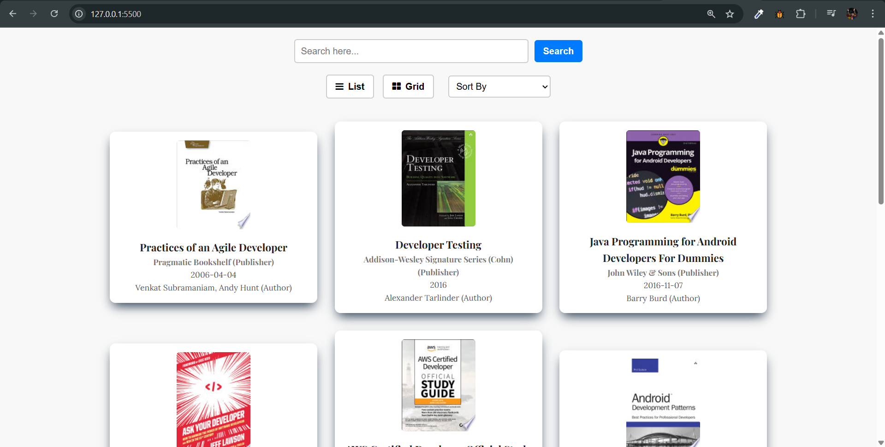
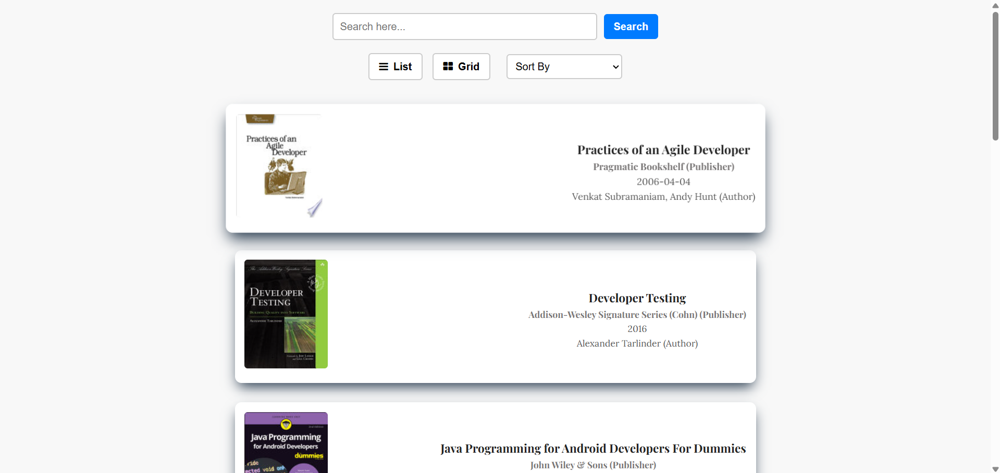
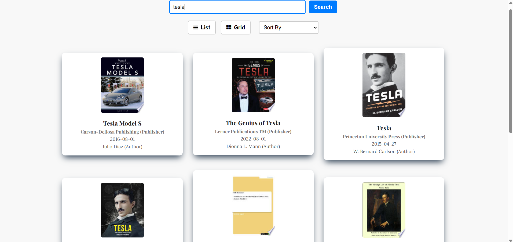
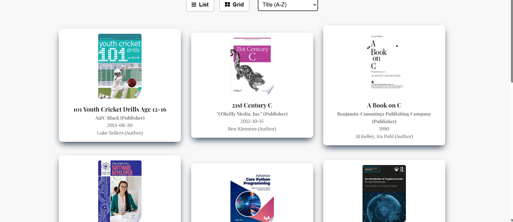
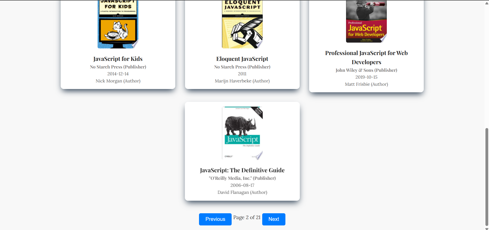

# Daily Book Tracker

## Application Features

- **Book Search**: Users can search for books by title or author.  
- **Sorting Options**: Books can be sorted alphabetically by title or by release date.  
- **List & Grid View**: Toggle between list and grid views for different browsing experiences.  
- **Pagination**: Books are displayed in pages with navigation controls for better accessibility.  
- **Lazy Loading Images**: Book thumbnails are loaded efficiently to optimize performance.   
- **Responsive Design**: Adjusts layout for better viewing on mobile devices.    

## Screenshots

### Main page of site

### Toggle view


### Search functionality


### Sort

### Pagination



## Deployment Link

[Live Demo](https://aj-books-lister.netlify.app/)

## How to Run Locally

1. Clone the repository:
   ```sh
   git clone https://github.com/AJTITAN/books-lister.git
   ```
2. Open `index.html` in your browser:
   ```sh
   open index.html
   ```

## Technologies Used

- **HTML** for structure
- **CSS** for styling
- **JavaScript** for interactivity


